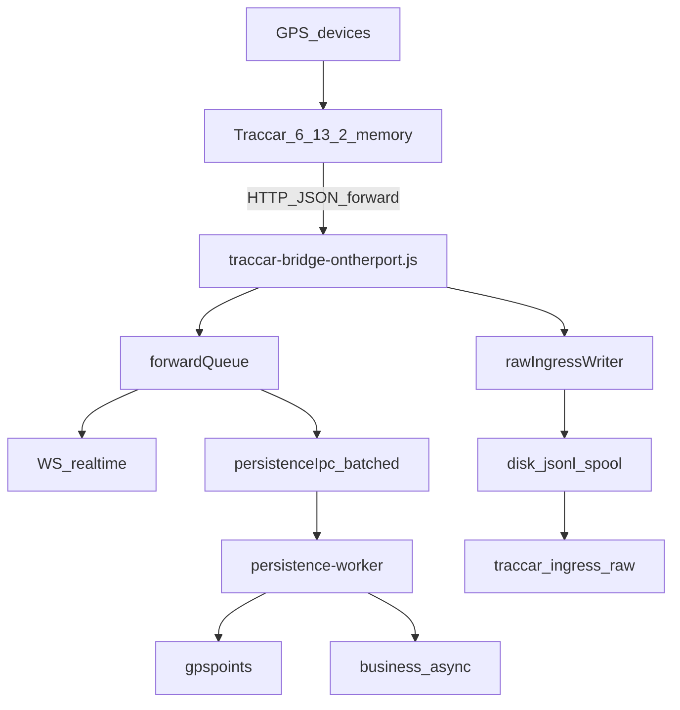

# Fix raw ingress consumer deadlock (P0)

## Diagnosis (CURRENT HEAD — verified in source)

### 1. Architecture (as deployed)



Realtime and persistence are already separated. Phase 1 IPC batching is present on HEAD (`PERSISTENCE_IPC_BATCH_MAX_ITEMS=100` in [`traccar-bridge-ontherport.js`](traccar-bridge-ontherport.js)). Audit/reverify docs are partially stale (e.g. sync raw FS, 1-item IPC, gpslogs) — do not trust old line numbers.

**Grok reports:** not present in the workspace yet (only [`alfursan-gps-audit-report.md`](alfursan-gps-audit-report.md), [`alfursan-gps-reverify-after-codex.md`](alfursan-gps-reverify-after-codex.md), [`docs/`](docs/)). Diagnosis below is from CURRENT HEAD, not those reports. If you attach Grok files later, findings will be re-checked against this fix only where they conflict.

### 2. Exact raw-ingress flow on HEAD

HTTP `POST /traccar/position` in [`traccar-bridge-ontherport.js`](traccar-bridge-ontherport.js) (~996–1042):

1. `raw_ingress_received_total++`
2. `rawIngressWriter.enqueue(buildTraccarRawIngressDoc(...))`
3. **If rejected → `503` immediately** (no normalize, no forward queue, no WS)
4. Else normalize → forward queue → `202`

Writer created at module load ([`traccar-bridge-ontherport.js`](traccar-bridge-ontherport.js) ~112–120):

- `insertMany: (docs) => TraccarIngressRaw.insertMany(docs, { ordered: true })` — model exists in [`mongo.js`](mongo.js)
- `maxQueueDepth = max(1000, TRACCAR_FORWARD_QUEUE_MAX||5000)` → **5000**
- `batchSize=250`, `flushMs=100`
- **No separate `start()`** — factory immediately kicks `refreshSpoolStats()` then may `scheduleFlush(0)` if pending spool files exist

Inside [`lib/traccarRawIngressWriter.js`](lib/traccarRawIngressWriter.js):

```text
enqueue → push activeWriteQueue → pumpActiveWrites()
  → async appendFile .jsonl.active (spooled_total++)
  → stop when activeDocs >= 250
  → scheduleFlush

flushCycle:
  if writingActive OR activeWriteQueue.length → reschedule 10ms; RETURN
  else rotateActive → drainFile → insertMany (mongo_attempted++ / persisted++)
```

### 3. Why `queue_depth=5000` while `mongo_attempted_total=0`

**Exact root cause: drain deadlock under sustained load.**

| Actor | Behavior |
|-------|----------|
| `pumpActiveWrites` | Stops appending when `activeDocs >= batchSize` (250) while memory queue still has items; schedules flush; **does not keep pumping** |
| `flushCycle` | Early-returns if `activeWriteQueue.length > 0` — **never `rotateActive` / never `persistBatch`** |

So under continuous ingress (queue never empty):

- Disk appends can continue one-at-a-time after the 250 threshold (each new enqueue wakes pump, which appends one more then breaks) → matches `spooled_total=1602`
- `persistBatch` never runs → **`mongo_attempted` stays 0** (not a missing `start()`, not a missing model — attempted is incremented only inside `persistBatch`, which is unreachable)
- `activeDepth = activeDocs + activeWriteQueue.length` grows to **5000** → rejects

This is **not** “Mongo down”: a failed `insertMany` would still bump `mongo_attempted` first.

```295:297:lib/traccarRawIngressWriter.js
      if (writingActive || activeWriteQueue.length) {
        scheduleFlush(10);
        return;
      }
```

```221:226:lib/traccarRawIngressWriter.js
      while (activeWriteQueue.length) {
        const doc = activeWriteQueue[0];
        await appendToActive(doc);
        activeWriteQueue.shift();
        if (!closed && activeDocs >= batchSize) break;
      }
```

### 4. Does raw rejection block realtime?

**Yes — proven on HEAD.**

```1004:1007:traccar-bridge-ontherport.js
    const rawQueued = rawIngressWriter.enqueue(buildTraccarRawIngressDoc(req.body, receivedAt));
    if (!rawQueued.accepted) {
      return res.status(503).json({ ok: false, error: rawQueued.reason });
    }
```

Raw archival is currently a **single point of failure for realtime**. This task will **not** change that coupling; after the drain fix, recommend a follow-up design discussion (accept forward + WS even if raw backpressured, while keeping at-least-once raw durability via spool) — primary priority remains realtime survival.

### 5. Traccar retry storm vs metrics

Yes — numbers fit a retry storm:

- `received=155898`, `accepted=5000`, `rejected=150898` → ~30× repeats after queue full
- Forward saw only `positions_received=5000` (packets that passed raw accept)
- Non-2xx (`503`) from forward URL typically causes Traccar to retry the same position

High `live_out_of_order_suppressed` / low live eligibility is **likely a consequence** of replaying older packets after retries — **do not change freshness rules in this task**.

### 6. Files to modify

- [`lib/traccarRawIngressWriter.js`](lib/traccarRawIngressWriter.js) — fix drain/wake lifecycle (primary)
- New focused test: `test/traccarRawIngressWriter.test.js`
- Possibly [`package.json`](package.json) — add the new test to a narrow script or document run command only (prefer explicit `node --test test/traccarRawIngressWriter.test.js`; avoid expanding full suite)

**Do not modify:** geofence, business queue, live eligibility, tenant throttle, model sync, startup reconciliation, IPC batching, bridge HTTP accept ordering (this PR).

### 7. Minimal proposed fix

Keep: bounded queue, async FS, disk spool, recovery, full `raw_payload`, retry backoff, shutdown flush.

Change only the consumer coordination:

1. **`flushCycle` must not refuse drain merely because `activeWriteQueue.length > 0`.** Wait only while `writingActive` (append in progress) to avoid rename/append races.
2. After `rotateActive()`, drain pending `.jsonl` via existing `drainFile` → `persistBatch` (`insertMany`).
3. After rotate/drain (or when deferring), **wake `pumpActiveWrites()`** if memory queue remains so spooling continues.
4. Keep `pump` batch break at `batchSize` so files stay bounded; once rotated, `activeDocs` resets and pump can continue.
5. Ensure Mongo failure path still retains spool files, bumps `raw_ingress_persist_failures`, and `scheduleRetry()` (already present).
6. Startup `refreshSpoolStats` + existing pending files must begin draining (existing spool depth ~15k must start moving — **do not delete spool files**).
7. Optional small observability: e.g. `raw_ingress_flush_deferred_total` / last error — only if useful and cheap; not required if existing counters become truthful.

**Intentionally unchanged:** HTTP 503-before-realtime semantics (report only); no raw sampling/slimming; no 8 workers.

## Test plan (focused only)

Add/run `test/traccarRawIngressWriter.test.js` covering:

1. Enqueue wakes writer / schedules drain
2. Queued docs reach mocked `insertMany`
3. `mongo_attempted_total` and `persisted_total` increment
4. Queue drains under sustained enqueue > `batchSize` with non-empty memory queue (the deadlock repro)
5. Useful batches (`>=1`, ideally up to batchSize)
6. Mongo failure retains spool / retries; later success persists
7. Spool recovery on create drains prior `.jsonl`
8. `flushAndStop` handles accepted queue
9. Hot-path enqueue does not call sync `appendFileSync` / `writeFileSync` (inject `fsImpl` with async-only promises)
10. `node --check lib/traccarRawIngressWriter.js` + `npm run test:syntax`

## Out of scope (explicit)

Geofence Phase 2, business queue Phase 3, 8-worker partition, voltage/model-sync work, tenant/live throttle changes, deploy/push, full test suite, load tests, claiming 10k-ready.

## After implementation — report checklist

Will deliver the 20-point final report you listed (root cause, old/new flows, HTTP semantics, retry-storm conclusion, duplicates/at-least-once, remaining risks, next `/health` checks).
