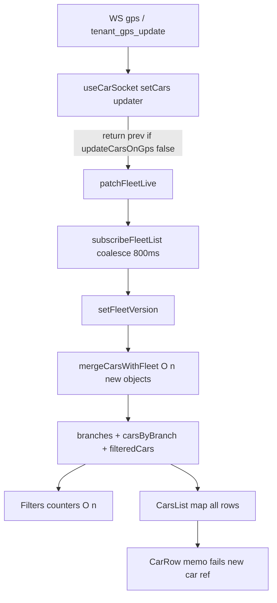

# Phase B — React Rerender / Live State Performance Audit

**Status:** B1 IMPLEMENTED (dirty-id referential-stable list). B2+ not started.

See implementation in:
- `alfoursan-react/src/utils/fleetPositionStore.js`
- `alfoursan-react/src/pages/TenantDashboard/TenantDashboard.jsx`
- `alfoursan-react/test/phaseB1FleetList.test.js`

---

## 1. High-frequency React rerender chain (TenantDashboard)

**GPS identity path is already correct** for React `cars` (`useFleetStore: true`, `updateCarsOnGps: false` → `return prev`). The remaining cost is **derived UI**: throttled full merge → new props for ~every seeded vehicle → full sidebar/filter remount work.

Maps (Google/OSM) use immediate `subscribeFleet` and are out of Phase B scope.

---

## 2. Hot-path `setCars` occurrences (realtime)

| Message | Location | Freq | Full array? | All refs change? | Required for visible UI? | Already in store? | Safe replacement |
|---------|----------|------|-------------|------------------|--------------------------|-------------------|------------------|
| `gps` / unwrapped `tenant_gps_update` | `useCarSocket.jsx` ~388–463 | Highest | Updater always runs; **returns same `prev`** on TD | No (identity stable) | Live via store + merge | Yes via `patchFleetLive` | Optional: skip entering `setCars` entirely when `!updateCarsOnGps` (CPU micro-opt) |
| `alarm` (attrs) | ~494–512 | Low–med | Yes `prev.slice()` | One new car + new array | Ignition/motion/charge badges | **No** from this handler | `patchFleetLive` + toast/pool only; skip `setCars` when `useFleetStore` |
| `heartbeat` | ~572–591 | Can be high | Yes always | One new car + new array | Voltage/power display | **No** (`voltage` not in store live fields) | Extend store live fields OR patch store; stop `setCars` when `useFleetStore` |
| `device` | ~601–633 | Low | Yes always (even if unchanged) | One new car + new array | Offline/online | Partial (`isOffline` already patched) | Early-return if unchanged; prefer store-only when `useFleetStore` |
| `command_response*` | ~326–379 | Rare | **No setCars** | — | Redux + toast | N/A | Keep |

Non-WS remeshes (necessary, low freq): HTTP snapshot `TenantDashboard.jsx` ~287–303; modal `device-updated` ~315+; geocode address ~442+.

**There is no bare `setCars(prev => prev.slice())` with zero field change.** Closest waste: heartbeat/device always allocate even when values unchanged; GPS still invokes React `setState` updater every packet for no-op.

---

## 3. Necessary vs removable (under TenantDashboard)

| Path | Verdict |
|------|---------|
| GPS → `patchFleetLive` | **Necessary** |
| GPS → `setCars` identity change | **Already removed** (`updateCarsOnGps: false`) |
| GPS → `setCars` updater invocation | **Removable CPU** (no product change if patch-only) |
| List `fleetVersion` → merge → sidebar | **Necessary for live sidebar**, but **full-array object churn is removable** |
| Heartbeat/device/alarm → `setCars` slice | **Removable** if same fields reach UI via store overlay |
| Commands → Redux | **Keep** |
| HTTP `mergeCarsPreferLive` + `seedFleetFromCars` | **Keep**; tighten equal-rank overwrite later (P2) |

---

## 4. Position vs metadata (Q2)

**Mixing proven:** HF fields are **not** written into React `cars` on GPS for TenantDashboard. They **are** re-injected into React tree every ≤800ms via `carsWithLive = mergeCarsWithFleet(cars)`.

| Layer | Contents | Change rate |
|-------|----------|-------------|
| `cars` useState | Metadata + stale snapshot HF | Rare (HTTP, alarm/heartbeat/device today) |
| `fleetPositionStore` | position, speed, heading, status, ignition, motion, charge, freshness timestamps, offline flags | Per packet |
| `carsWithLive` | Full overlay | ~800ms coalesce |

Alarm/heartbeat/device still leak HF-ish / status fields into `cars` and force whole-tree remesh.

---

## 5. Heartbeat / device / alarm (Q3)

| Event | Why `prev.slice()` exists | UI dependents | Can UI use smaller signal? | Patch one IMEI? |
|-------|---------------------------|---------------|----------------------------|-----------------|
| Heartbeat | Put `voltage` on car for row power badge | `CarRow` `car.power` / voltage parsing | Yes — store field + merge | Yes |
| Device | Online/offline into `cars` + store | Filters offline count, row status | Yes — store already patched | Yes; also early-return if unchanged |
| Alarm attrs | Ignition/motion/charge on car | Row badges / status color | Yes — `patchFleetLive` | Yes; toast/pool stay outside cars |

Do not remove toast / `pushAlarmEntry` / `onAlarmSelectCar` when diverting telemetry to store.

---

## 6. Sidebar cost (Q4) — evidence

- Trigger: `subscribeFleetList(setFleetVersion)` + `FLEET_LIST_THROTTLE_MS = 800`
- `mergeCarsWithFleet`: `cars.map` → **new object whenever live entry exists** (post-seed ≈ all)
- Per tick at 2k: O(n) merge + O(n) branches + O(n) filter + O(n) Filters counters (`isVehicleMoving` per online car) + O(n_filtered) DOM rows
- **All rows get new `car` props ~every 800ms** under live GPS
- `CarRow = memo`: **ineffective** — default shallow compare fails on new `car` every tick; inner `useMemo([car])` also useless

---

## 7. Virtualization (Q5)

- **Needed at 2k–10k** if rows stay fully mounted; less urgent if B1 makes memo + dirty-only merge work
- **No** `react-window` / `@tanstack/react-virtual` / virtuoso in `package.json`
- Prefer later: **`@tanstack/react-virtual`** (flexible measured rows, scrollToIndex) over `react-window` (rigid) or custom windowing
- Preserve: `data-car-id` scroll → `scrollToIndex`; search overlay; filters; flat branch list (no sticky groups); RTL/`dir`; dropdown portals

**Defer install to Phase B2/D** after B1 referential fix — virtualization alone does not fix Filters O(n) or merge O(n).

---

## 8. Store selectors (Q6)

| API | Exists? |
|-----|---------|
| Subscribe all / immediate | `subscribeFleet(version, change)` |
| Subscribe list/version throttled | `subscribeFleetList(version)` |
| Subscribe one IMEI/deviceId | **Missing** |
| Read one | `getFleetLive(deviceId)`, `getDeviceIdBySerial` |
| Change payload | `{ deviceId, patch, prev, next, visualChanged }` |

**Smallest extension:** dirty-id set for list coalesce (B1), then later `subscribeFleetDevice(deviceId, listener)` (B2). Preferred end state: `CarRow` reads `getFleetLive(id)` and skips parent merge churn — larger than B1.

---

## 9. Counters / full-fleet scans (Q7)

Every list tick: Filters rescans **entire** `carsByBranch` for total/online/offline/moving. No idle/alarms sidebar counters. No incremental counters today.

Propose later: maintain running counts in store on `patchFleetLive` transitions, or throttle counter derive separately from row props.

---

## 10. React Query / snapshot (Q8)

- HTTP: `mergeCarsPreferLive` then `seedFleetFromCars` — store protected if `liveRank(store) > liveRank(API)`
- Gap: **equal rank** can overwrite store; React merge **does not read store**, so with `updateCarsOnGps: false` React HF can look older than store until overlay
- Does not cause per-packet remesh; can cause occasional full remesh + stale flash — P2

---

## 11. Bottlenecks ranked

| Priority | Issue | Impact |
|----------|-------|--------|
| **P0** | `mergeCarsWithFleet` allocates new object for every seeded car every ≤800ms → memo dead → 2k row work | Dominant continuous cost |
| **P0** | Filters + branch + filter pipelines O(n) every list tick | Couples to P0 |
| **P1** | Heartbeat/device/alarm `setCars` ignore `updateCarsOnGps` / store | Sporadic full-tree remesh |
| **P1** | GPS still schedules no-op `setCars` updater every packet | Main-thread CPU |
| **P2** | No per-device list subscription / no virtualization lib | Scale 5k–10k |
| **P2** | HTTP equal-rank / React-merge-without-store | Occasional clobber |
| **P2** | Incremental counters | Counter CPU after P0 fixed |

---

## 12. Smallest safe implementation plan (ordered)

1. **B1 (recommended below)** — referential-stable / dirty-only list merge
2. **B1b** — route heartbeat/device/alarm telemetry through `patchFleetLive` when `useFleetStore`; stop `setCars` slice
3. **B2** — optional `subscribeFleetDevice` + CarRow self-subscribe; skip full merge for rows
4. **B2** — incremental or throttled counters
5. **B3 / Phase D** — virtualize CarsList (`@tanstack/react-virtual`); no install in B1
6. **P2** — snapshot merge consult store ranks

Out of scope remains: Node, Laravel, map providers, playback, commands rename, freshness rewrite.

---

## RECOMMENDED PHASE B1

**Goal:** Cut the most unnecessary React work with the smallest behavior-preserving change.

**Do this only:**

1. Keep `subscribeFleetList` 800ms coalesce and `fleetVersion` (or equivalent dirty signal).
2. Replace “remap all cars to new objects every tick” with a **stable merge cache**:
   - Maintain last merged list / by-id refs.
   - On list notify, collect dirty `deviceId`s since last flush (small store extension: dirty set filled by `patchFleetLive` / seed).
   - Remerge **only dirty ids**; return **previous object references** for unchanged ids.
   - If no dirty ids, skip `setFleetVersion` / keep same `carsWithLive` reference.
3. Leave Google/OSM/map providers, Phase A device subscribe, commands, freshness, Node, Laravel untouched.
4. Do **not** install virtualization yet.
5. Do **not** redesign CarRow to per-IMEI subscribe yet (that is B2).

**Why B1 wins:** Restores effectiveness of existing `React.memo` on `CarRow`, avoids O(n) DOM reconciliation for untouched rows, preserves Moving/Static/offline UI for cars that actually changed, no product/API change.

**Acceptance (when implementing later):** Under steady multi-vehicle GPS, unchanged rows do not re-render; dirty rows update within ~800ms; filters still correct; selected/scroll/search unchanged; focused tests for merge referential equality + dirty set.

**STOP — no implementation in this phase.**
