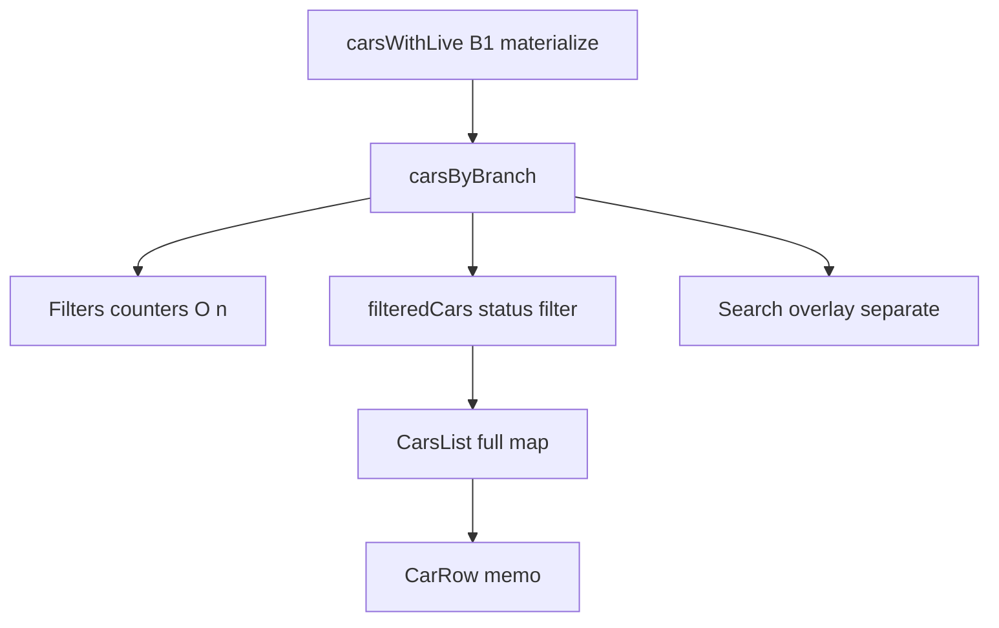

# Phase D — CarsList Virtualization Audit

**Mode:** plan only — NO IMPLEMENTATION.  
**Source of truth:** CURRENT HEAD after Phase A + B1 + full bootstrap + B2.

Node/Laravel frozen. Do not regress prior phases. No package install yet.

---

## 1. Current CarsList architecture



**Files**

| Piece | Path |
|-------|------|
| Orchestration | [`TenantDashboard.jsx`](D:/projeccts/techno/alfoursan-react/src/pages/TenantDashboard/TenantDashboard.jsx) |
| Shell | [`SideMenu.jsx`](D:/projeccts/techno/alfoursan-react/src/pages/TenantDashboard/SideMenu/SideMenu.jsx) |
| List + `CarRow` (inline) | [`CarsList.jsx`](D:/projeccts/techno/alfoursan-react/src/pages/TenantDashboard/SideMenu/sections/CarsList.jsx) |
| Filters | [`Filters.jsx`](D:/projeccts/techno/alfoursan-react/src/pages/TenantDashboard/SideMenu/sections/Filters.jsx) |
| Search | [`Search.jsx`](D:/projeccts/techno/alfoursan-react/src/pages/TenantDashboard/SideMenu/sections/Search.jsx) |

**Flow**

1. `carsWithLive` = B1 referential-stable overlay  
2. `carsByBranch` = optional branch select (flat `<select>`, no nested groups)  
3. `filteredCars` = status filter (`all` / `online` / `offline` / `moving`)  
4. `CarsList` receives `filteredCars` and **maps every car to a mounted `CarRow`**  
5. Search is a **separate overlay** over `carsByBranch` — not the main scroller

**Scrolling container:** CarsList root  
`div.flex.flex-col.gap-1.overflow-y-auto.flex-1` inside fixed `aside` `max-w-[400px]` `h-screen`.

**No row collapse/expand.** Branch filter only. Actions bar above list.

---

## 2. Current DOM / mount behavior

```196:203:D:/projeccts/techno/alfoursan-react/src/pages/TenantDashboard/SideMenu/sections/CarsList.jsx
      {cars.map((car) => (
        <CarRow
          key={car.id}
          car={car}
          isSelected={car.id === selectedCarId}
          handleSelectCar={handleSelectCar}
        />
      ))}
```

- **All filtered vehicles mount** (2k → ~2k `CarRow` + Radix dropdown roots).  
- Stable React key already: **`car.id`** (durable device id).  
- B1 + `memo(CarRow)`: unchanged cars skip re-render when only sibling dirty; **DOM nodes still exist for all**.  
- Off-screen dirty B: no `CarRow` re-render (memo), but node still in tree / scroll height.

---

## 3. Row height findings

**Layout of `CarRow`:** single horizontal flex row — ignition icon + `line-clamp-1` name + optional power pill + status text + ⋮ menu.

| Factor | Effect on height |
|--------|------------------|
| `line-clamp-1` on name | Prevents multi-line name growth |
| Power badge `h-5` | Fixed; `shrink-0` |
| Status string | Single line; Arabic labels short |
| Padding `p-2` + `text-xs` | Uniform |
| `gap-1` between rows | Constant 4px |
| Dropdown | **Portal** — does not grow row height |
| Driver name / plate in row | **Not shown** in list row |
| Expandable row | **None** |

**Verdict:** height is **effectively fixed**. Prefer **fixed `estimateSize`** (measure once from one rendered row in implementation, likely ~40–48px content + 4px gap ≈ **44–52px** stride). Measurement API optional, not required for correctness.

Do **not** redesign CarRow.

---

## 4. Existing scroll-to-selected behavior

```184:190:D:/projeccts/techno/alfoursan-react/src/pages/TenantDashboard/SideMenu/sections/CarsList.jsx
  useEffect(() => {
    if (!selectedCarId || !listRef.current) return;
    const row = listRef.current.querySelector(
      `[data-car-id="${selectedCarId}"]`,
    );
    row?.scrollIntoView({ behavior: "smooth", block: "nearest" });
  }, [selectedCarId, selectionTrigger]);
```

**Triggers that bump selection**

- List click: `handleSelectCar(car, true)`  
- Map marker / Search / Alarm go-to-map → `handleSelectCar(..., true)` → increments `selectionTrigger` when `shouldZoom`  
- Deselect: `handleSelectCar(null)` — no scroll

**If selected car is filtered out:** `querySelector` finds nothing → **no-op** (CURRENT). Preserve: do not invent “clear filter” or “jump to unfiltered index”.

**DOM refs:** only `data-car-id={car.id}` on each row; no per-row `ref` map.

**Target after virtualization:**

```
selectedCarId + selectionTrigger
  → index = filteredCars.findIndex(c => c.id === selectedCarId)
  → if index >= 0: virtualizer.scrollToIndex(index, { align: 'nearest', behavior: 'smooth' })
  → if index < 0: no-op (same as today)
```

---

## 5. Virtualization library recommendation

**`package.json`:** no `react-window`, `@tanstack/react-virtual`, virtuoso, etc.

| Option | Fit |
|--------|-----|
| **`@tanstack/react-virtual`** | Headless; React 19 OK; `scrollToIndex`; dynamic `count`; fixed or measured size; works with existing scroll parent; small API surface; already in TanStack family (`react-query` present) |
| `react-window` | Fixed-size lists are fine, but weaker dynamic count / scrollToIndex DX; more wrapper components |

**Recommendation: `@tanstack/react-virtual` only** (install in implementation phase, not now).  
Do **not** invent custom windowing.

Initial overscan: **`overscan: 8`–`12`** rows (~viewport ~15–25 rows in 400px-wide / ~full-height sidebar after chrome → target **~25–40 mounted**).

---

## 6. Exact integration design (implementation later)

**Scope:** primarily [`CarsList.jsx`](D:/projeccts/techno/alfoursan-react/src/pages/TenantDashboard/SideMenu/sections/CarsList.jsx). Optionally tiny prop pass-through only if needed. **Do not** change Filters/Search/B1/B2/maps.

```text
CarsList
  parentRef = scroll div (existing overflow-y-auto)
  virtualizer = useVirtualizer({
    count: cars.length,
    getScrollElement: () => parentRef.current,
    estimateSize: () => ROW_STRIDE_PX,  // fixed
    overscan: 10,
    getItemKey: (i) => cars[i].id,
  })
  inner spacer height = virtualizer.getTotalSize()
  map virtualizer.getVirtualItems() → absolute/transform positioned CarRow
```

- Keep `key={car.id}` / `getItemKey` = durable id.  
- Keep `memo(CarRow)`; props: `car`, `isSelected`, `handleSelectCar` (already stable `useCallback` in TD).  
- Loader overlay stays above/inside list without breaking scroll metrics.  
- Radix dropdown Portal unchanged.

**Unstable refs to avoid:** do not rebuild `itemData` objects every render; do not inline new `handleSelectCar` wrappers; when `filteredCars` array identity changes every B1 tick but element refs stable, virtualizer should only refresh the dirty visible item — rely on `getItemKey` + memo.

---

## 7. B1 compatibility

| Event | Expected |
|-------|----------|
| GPS/heartbeat/device/alarm dirties B, B **visible** | Only that `CarRow` re-renders |
| B **off-screen** | No mounted row for B → **zero** CarRow work for B |
| Virtualizer | Must not remount all visible rows solely because `filteredCars` array identity changed |

B1 already keeps other `car` refs identical; Phase D must not pass a new `cars` item accessor that clones all items.

---

## 8. Filter / search compatibility

- Filter/branch change → new `filteredCars` length → `count` updates; scroll may jump — acceptable; reset measurements if library requires on count change (TanStack handles via `count`).  
- Search dropdown remains **non-virtualized** (typically small result set) — out of Phase D unless later.  
- Selected car filtered out → scroll no-op (CURRENT).

---

## 9. RTL / responsive compatibility

- `document.documentElement.dir` set from i18n (`main.jsx`).  
- Sidebar is **hard-coded `left-0` / open from left** — not a mirrored RTL drawer today. Virtualization is vertical; RTL mainly affects row flex text — preserve as-is.  
- Mobile: `w-full max-w-[400px]` overlay; same vertical list. Touch scroll on overflow container must remain the virtualizer scroll element.  
- Toggle open/close via translate — list unmounts from view but component may stay mounted; OK.

---

## 10. Risks

1. Absolute positioning vs `gap-1` — bake gap into `estimateSize` or row wrapper padding.  
2. Smooth `scrollToIndex` support nuances across browsers — match CURRENT `smooth` + `nearest`.  
3. `isFetching` Loader inside scroll parent may affect `clientHeight` — keep loader outside scroll content or absolute overlay.  
4. Filter churn still O(n) CPU — Phase D does not fix that; users may still feel “list tick” cost from Filters/parent, but DOM cost drops.  
5. Installing `@tanstack/react-virtual` is a **new dependency** (approved only at implement time).

---

## 11. Exact files expected to change (implementation)

| File | Change |
|------|--------|
| `CarsList.jsx` | Virtualizer + scrollToIndex; keep CarRow |
| `package.json` / lockfile | Add `@tanstack/react-virtual` |
| Focused tests | New `test/phaseDCarsListVirtual.test.js` (mostly structural / unit around helpers if extracted) |

Unchanged: SideMenu filters/search logic, TenantDashboard data pipeline, fleet store, maps, B2 hook.

---

## 12. Focused tests required (future)

1. Virtualizer `count === filteredCars.length`  
2. Mounted virtual items bounded (e.g. ≤ overscan*2 + viewport estimate) for large N  
3. `getItemKey` / React `key` uses `car.id`  
4. Scroll-to-selected: given `selectedCarId` + trigger, calls scroll path with correct index  
5. Filtered-out selected id → no throw / no scroll  
6. Filter length change updates count  
7. B1: patch one id → only that car ref changes in materialize (existing B1 tests) + CarRow memo props story  
8. Source/RTL: list still vertical; SideMenu left rail unchanged  
9. Empty list / loading still render  
10. `npm run build`  

No 10k browser load until separately approved.

---

## 13. Expected performance improvement

| Fleet | CURRENT mounted CarRows | TARGET mounted |
|-------|-------------------------|----------------|
| 2,000 filtered | ~2,000 | ~25–40 (+ overscan) |
| 10,000 filtered | ~10,000 | ~25–40 (≈ constant) |

Benefits: lower DOM memory, faster style/layout, cheaper React commit when scrolling, preserves B1 memo wins for visible dirty rows only.

Does **not** remove Filters O(n) or B1 merge O(dirty) / parent `filteredCars` filter O(n).

---

## 14. RECOMMENDED PHASE D IMPLEMENTATION

1. Install **`@tanstack/react-virtual`** only.  
2. Virtualize **only** `CarsList` scroll body with **fixed** row stride + `overscan ≈ 10`.  
3. Replace `querySelector` + `scrollIntoView` with **`scrollToIndex`** on `selectedCarId` / `selectionTrigger`; no-op if not in `filteredCars`.  
4. Keep `CarRow` memo, `key={car.id}`, Radix portals, Search/Filters untouched.  
5. Focused tests + build; no map/Node/Laravel/B1/B2 changes.  

**STOP — no implementation in this phase.**
