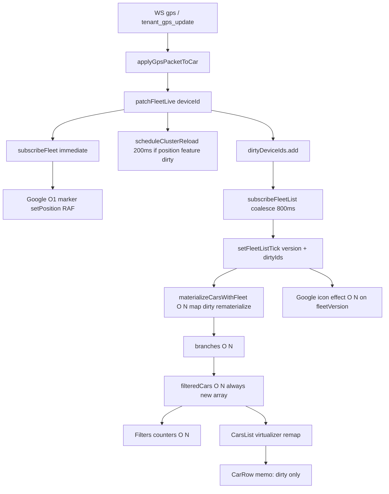

# Phase E — Default Google Monitor Steady-State CPU Audit

**Mode:** plan only — NO IMPLEMENTATION.  
**Source of truth:** HEAD after Phase A + B1 + full bootstrap + B2 + D.  
Google is the **default** production map. MapLibre DOM markers = deferred Phase C (not ranked here).

---

## 1. One-GPS-packet operation graph



| Step | Cost |
|------|------|
| Packet accept + `patchFleetLive` | O(1) |
| `subscribeFleet` → one marker + rAF | **O(1)** per changed IMEI |
| Supercluster reload (if clustering + position dirty) | Debounced **200ms** → `load` **O(N log N)** |
| List flush materialize | O(N) array build; **O(dirty)** new objects |
| `branches` / `filteredCars` / Filters | **O(N)** each |
| CarsList virtual map | O(visible + overscan) |
| CarRow | O(dirty ∩ visible) via memo |
| Google icon `useEffect(fleetVersion)` | **O(N)** walk every list tick |

---

## 2. Remaining O(N) operations (Google default path)

1. Google marker **icon/color/rotation** effect on `fleetVersion`  
2. Google **label** effect on `cars` identity (less frequent if base cars stable)  
3. Google cluster **idle**: `markers.forEach` setVisible  
4. Supercluster **`load(all features)`** after position dirty (200ms)  
5. `materializeCarsWithFleet` `.map` over full fleet when any dirty  
6. `branches` rebuild  
7. `filteredCars.filter` (even `activeFilter === "all"`)  
8. Filters counter forEach + `isVehicleMoving`  
9. `selectedCar` `.find`  
10. Meta Map rebuild when `cars` identity changes (HTTP/metadata only under B2)

---

## 3. Google marker / icon update cost

**Position (good — keep):**

```311:391:GoogleMapView.jsx
subscribeFleet → change.deviceId → pending setPosition → RAF
```

Steady-state: **O(1)** per changed vehicle. No full `setPosition` fan-out.

**Icon (remaining cost):**

```265:309:GoogleMapView.jsx
deps: [map, carIdsKey, createRotatedMarker, getCarColor, fleetVersion]
```

- Frequency: every B1 list flush (~800ms under traffic), not every GPS packet  
- Scans: **all N** cars in `carsMetaRef`  
- `setIcon`: only if color or rotation actually differ (guarded)  
- Still pays **O(N)** `getCarColor` / `getIcon` / comparisons every tick  

**Labels:** O(N) on `cars` identity; guarded `setLabel`.

---

## 4. Supercluster cost

| Event | Behavior | Cost |
|-------|----------|------|
| Fleet membership (`carIdsKey`) | Full `buildGeoJsonFeatures` + `load` | O(N) + O(N log N) |
| Position dirty via subscribeFleet | Mutate feature coords → `scheduleClusterReload` | Coalesce **200ms** then full `load` |
| Map `idle` / clusters toggle | Hide/show **all** markers + recreate cluster markers | O(N) + O(K) |

Not every GPS packet reloads immediately; movement batches to ≤1 reload / 200ms while cars move. Still **full index rebuild**, not incremental.

---

## 5. `filteredCars` cost

```213:224:TenantDashboard.jsx
return carsByBranch.filter(...)  // always new array
```

- Frequency: every `fleetListTick` (~800ms)  
- Always **O(N)**; identity **always new** even for `"all"`  
- Virtualization: new array ≠ remount all rows (Phase D + B1 memo)  
- Still causes parent/SideMenu/Filters/CarsList **JS re-render** and Filters recompute  

---

## 6. Counter / filter scan cost

| Counter | Full scan? | Frequency | Fields |
|---------|------------|-----------|--------|
| all | length only | ~800ms | — |
| online | Yes (shared pass) | ~800ms | !offline && !inactive |
| offline | Yes | ~800ms | isOffline |
| moving | Yes | ~800ms | isVehicleMoving (speed + freshness) |
| inactive | Counted, UI commented out | ~800ms | isInactive |

One forEach in Filters — not four separate scans — but **duplicated** with `filteredCars` moving filter and per-row `getCarStatus`.

---

## 7. Duplicated status classification

| Consumer | API |
|----------|-----|
| Filters | `isVehicleMoving` |
| `filteredCars` | same predicates |
| CarRow | `getCarStatus` **and** `isVehicleMoving` again |
| GoogleMapView | `getCarStatus` → color |

Semantics must stay; opportunity is **share derived class** or compute once per dirty id later.

---

## 8. TenantDashboard rerender fan-out

Every list flush: `setFleetListTick` → TD commit → SideMenu (unmemoized) → Filters, Search, CarsList, Maps.

Memoized: **CarRow only**.

Expensive unmemoized children re-enter render; DOM cost limited by Phase D.

---

## 9. B1 dirty-id reuse

| Candidate | Verdict | Why |
|-----------|---------|-----|
| A. Google icon/status for dirty ids only | **SAFE** | Same guards as today; only skip walking clean markers. Need prior color/rotation or recompute from `getFleetLive`+meta for dirty set. Pass `dirtyIds` from `fleetListTick` or store `getLastFlushedDirtyIds`. |
| B. Incremental counters | **NEEDS GLOBAL RECOMPUTE** (initially) or careful delta | Moving±1 needs previous class per id; store has live fields but not cached class. Can keep last class map → then SAFE incremental; without it, NEEDS full scan or build class cache first. |
| Supercluster | **NOT SAFE** as pure dirty-only without library support | Index is global; dirty coords already mutate features then full `load`. True incremental cluster index = larger change. |

---

## 10. Phase D effectiveness

**Confirmed:** CarsList uses `useVirtualizer`; no `cars.map` of full fleet; mounted rows ≪ N; B1 stable refs + memo → dirty visible rows only.  

**Remaining:** JS O(N) in parent Filters/`filteredCars`/Google icon effect — **computation**, not DOM.

---

## 11. Google-default bottlenecks

| Priority | Issue |
|----------|--------|
| **P0** | Google **O(N) icon/color walk** on every `fleetVersion` list tick |
| **P1** | Supercluster **full `load` O(N log N)** ≤200ms while fleet moves + **O(N) setVisible** on idle |
| **P1** | `filteredCars` always-new + Filters O(N) + duplicated `isVehicleMoving` |
| **P2** | `branches` O(N); `selectedCar` find O(N); SideMenu unmemoized |
| **P3** | Meta Map / `carIdsKey` when base `cars` changes |

**Deferred (not Google-default):** Phase C MapLibre/MapTiler/Mapbox GeoJSON.

---

## 12. Manual profiling checklist (owner)

**Chrome Performance (~20s, 50+ moving vehicles):**  
Main-thread CPU, Scripting vs Rendering vs Painting, FPS, Long tasks (>50ms), JS heap.

**React Profiler:**  
TenantDashboard / SideMenu / CarsList / CarRow / GoogleMapView commit counts and durations during list ticks.

**WS / list:**  
GPS packets/s; observe ~800ms list flush cadence vs 200ms cluster reloads.

No source instrumentation in this phase.

---

## 13. RECOMMENDED NEXT IMPLEMENTATION — ONE PHASE ONLY

### OPTION 1 — Targeted Google dirty-id icon/status updates

**Why (evidence):** Default map; position path already O(1); largest remaining **unconditional O(N) Google work** every ~800ms is the icon effect tied to `fleetVersion`. B1 already produces `dirtyIds` on the same tick — reuse is **SAFE**.

**Not now:** Option 2 (filters) — important but secondary to default map CPU.  
**Not now:** Option 3 (Supercluster) — real P1 but higher risk / larger design.  
**Not now:** Option 4 (Phase C) — non-default providers.

**STOP — no implementation.**
