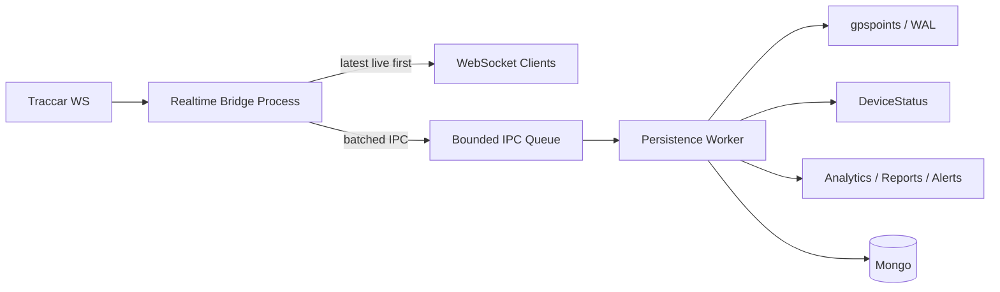

# Traccar Realtime Isolation

## Goal
Split the current bridge into a thin realtime ingress path and a separate persistence worker, while keeping `traccar-bridge.js` and `traccar-bridge-ontherport.js` as the only PM2 entry points.

## Proposed architecture

## Implementation plan
- Extract the shared realtime ingress flow from `traccar-bridge-ontherport.js` and `traccar-bridge.js` into one production-used pipeline module, reusing the tested live-selection logic already in `lib/positionPipeline.js`.
- Make the realtime handler do only cheap work: decode, map deviceId/IMEI from cache, select the latest eligible live position per IMEI, emit live GPS immediately, and enqueue the full batch for persistence.
- Add a persistence worker process (for example `workers/persistence-worker.js`) and a small IPC helper (`lib/persistenceIpc.js`) that batches messages, tracks queue depth/backpressure, and acks durable acceptance separately from live delivery.
- Move heavy persistence-side responsibilities behind the worker boundary: gpspoints journaling/spool, Mongo retries, DeviceStatus, reporting schedulers, notifications, and analytics.
- Keep command/command-response fast paths in the realtime process so they are not delayed by historical GPS bursts.
- Preserve the archive invariant: all valid GPS positions still reach storage, including bursts and out-of-order points; no latest-only behavior in persistence.
- Keep realtime mapping cache behavior non-blocking: cache hits emit immediately, misses refresh asynchronously, and live emit must not wait on Mongo lookups.
- Remove synchronous filesystem work from realtime hot paths; any remaining WAL/spool work should live only in the persistence worker.
- Add health/metrics for realtime PID, worker PID, IPC queue depth, worker liveness, live latency, and worker ack/pending counts.

## Files likely to change
- `[traccar-bridge-ontherport.js](d:\projeccts\techno\alfursan\gps-server\traccar-bridge-ontherport.js)`
- `[traccar-bridge.js](d:\projeccts\techno\alfursan\gps-server\traccar-bridge.js)`
- `[lib/positionPipeline.js](d:\projeccts\techno\alfursan\gps-server\lib\positionPipeline.js)`
- `[lib/gpsPointWriter.js](d:\projeccts\techno\alfursan\gps-server\lib\gpsPointWriter.js)`
- `[gpsPointStore.js](d:\projeccts\techno\alfursan\gps-server\gpsPointStore.js)`
- new worker/helper modules under `d:\projeccts\techno\alfursan\gps-server\workers\` and `d:\projeccts\techno\alfursan\gps-server\lib\`

## Test strategy
- Add integration tests that exercise the real production handler path, not only helpers, to prove live GPS is emitted before historical persistence.
- Extend existing durability tests to prove that 100 same-IMEI points are all archived and that journal coalescing is batching, not overwriting.
- Add burst-order tests for "historical flood + one fresh point" and "historical flood + command response".
- Add worker-failure tests for restart/recovery and bounded IPC backlog.
- Keep all existing live-eligibility, load, and persistence tests passing.
